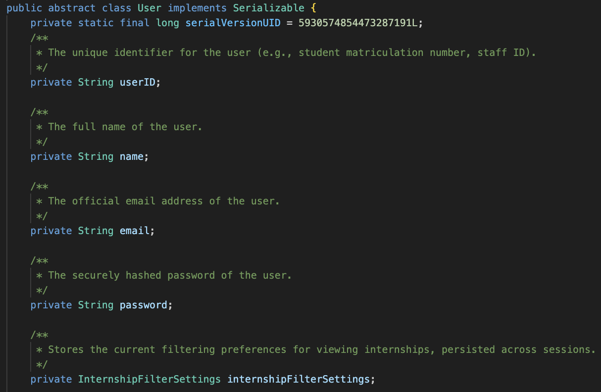
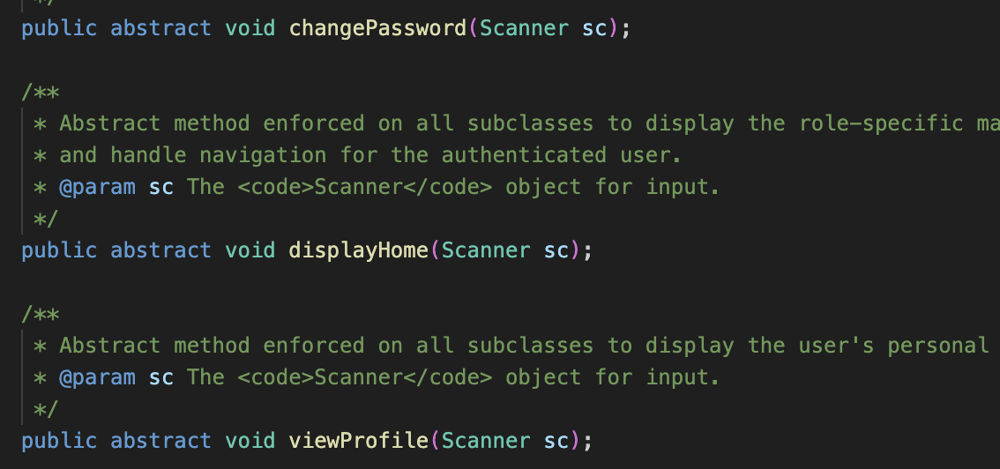
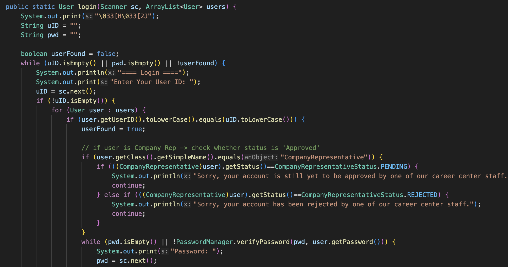
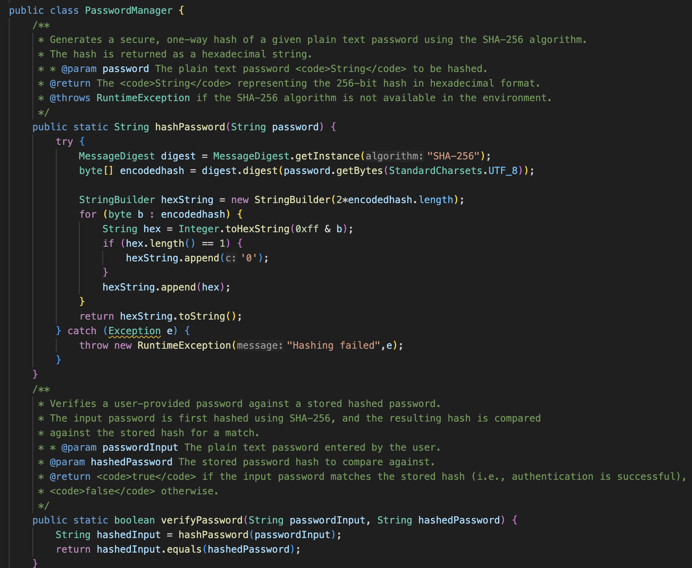
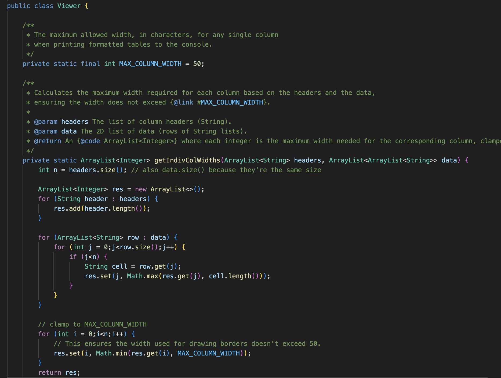
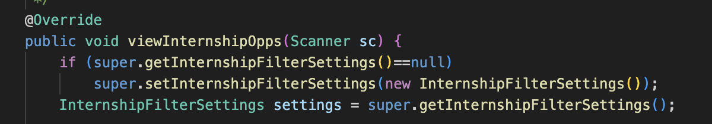
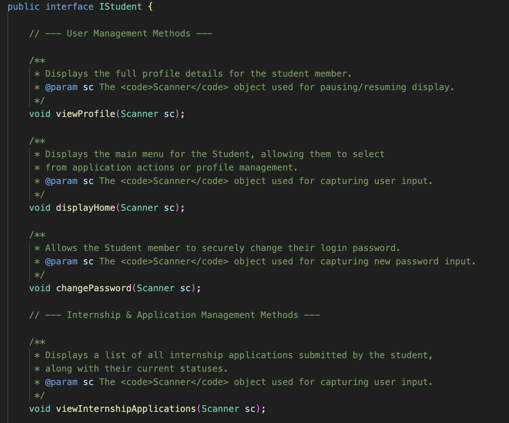
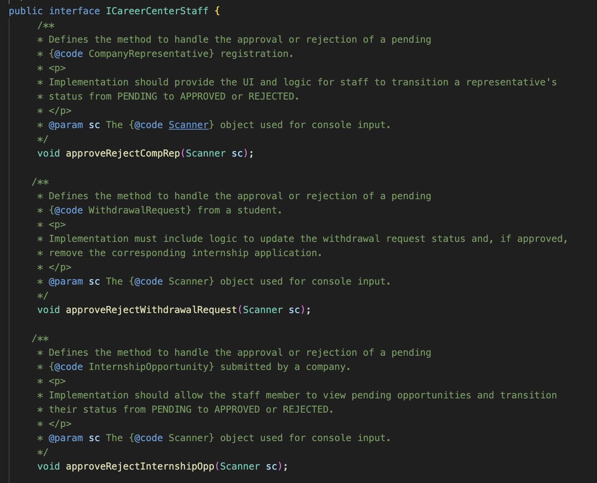
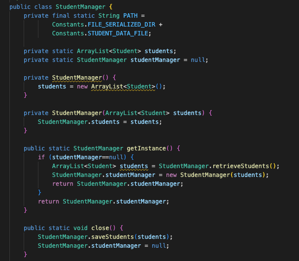

# Reference Notes

- **Project**: Internship Placement Management System (SC2002 OOP)

## Figures for Sc2002 Report
 
`Figure 5.1.1a`: Different User Fields

 
`Figure 5.1.1b`: Abstract methods changePassword(), displayHome() and viewProfile()

 
`Figure 5.1.2`: Login and Polymorphic call site

`Figure 5.1.4a`: PasswordManager responsibility only on verifying and hashes

`Figure 5.1.4b`: Class Viewer responsibility only on rendering tables.

`Figure 5.1.4c`: viewInternshipOpps() method filter settings set to null

`Figure 5.1.4d`: IStudent interface with student specific methods only

`Figure 5.1.4e`: ICareerCenterStaff interface with staff specific methods only

`Figure 5.3.3`: StudentManager with getInstance() and close() methods
